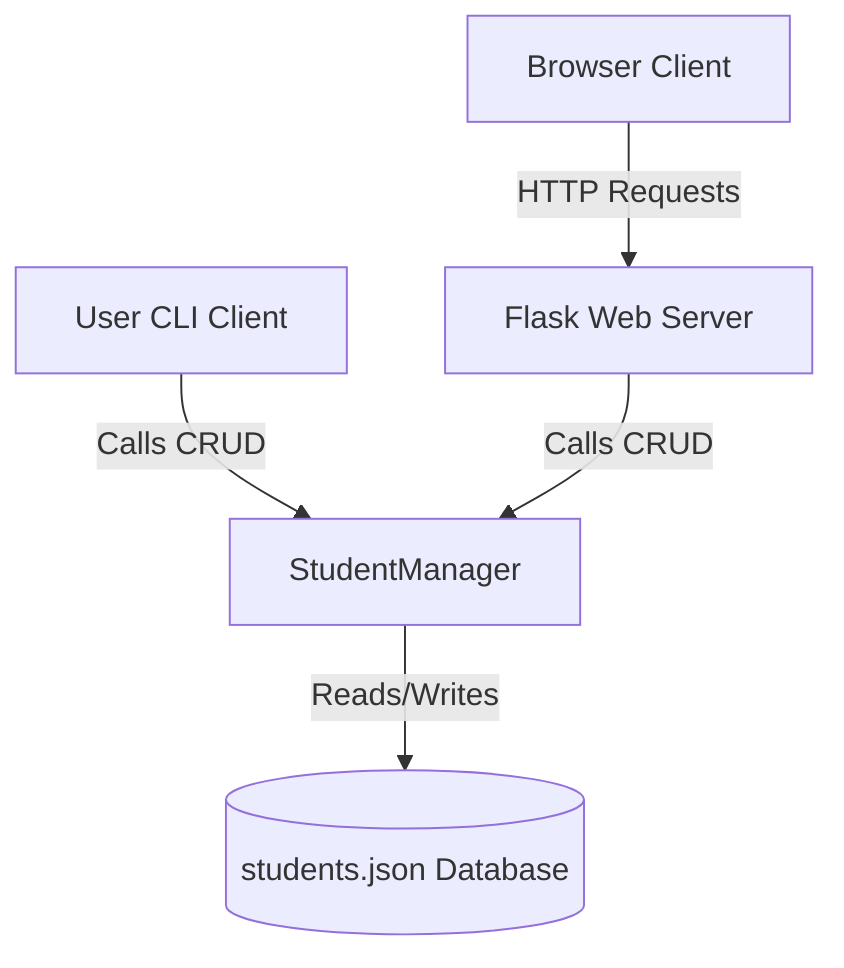
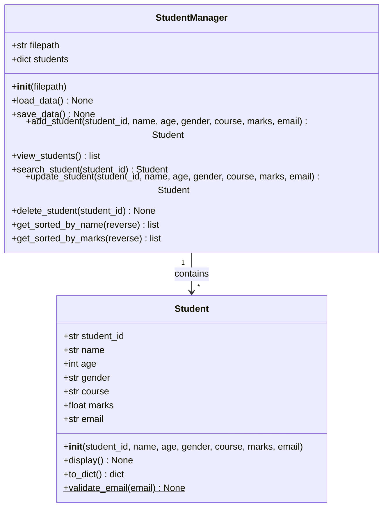
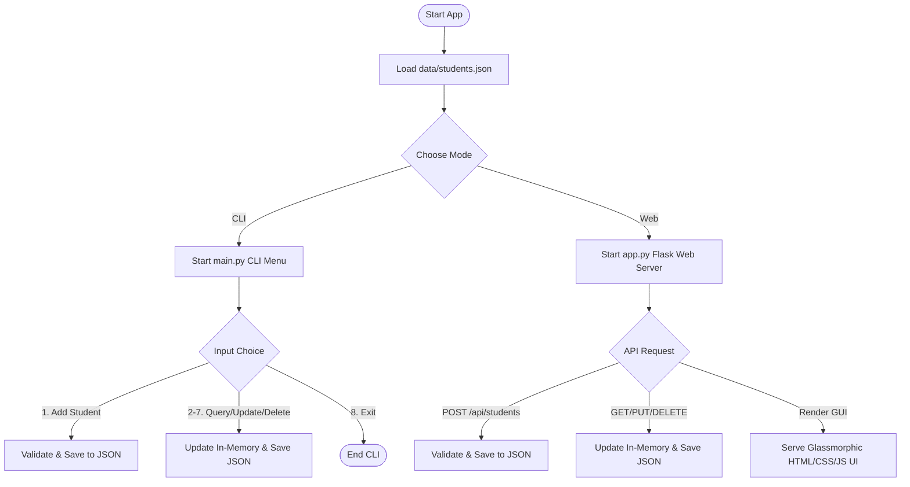
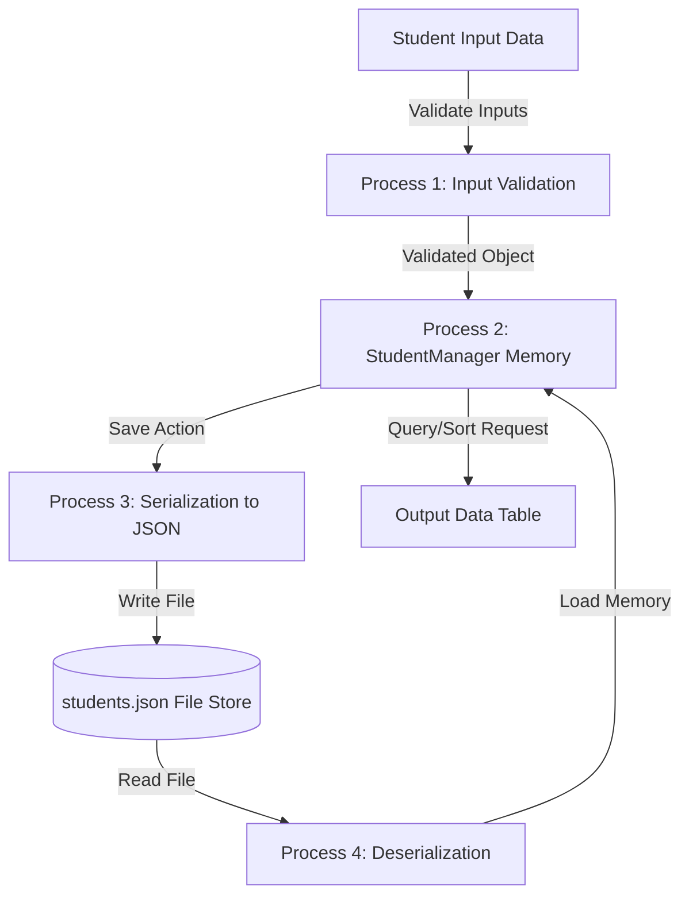

# Project Report: Student Management System

This document provides a comprehensive academic and professional report on the design, architecture, implementation, and testing of the **Student Management System**.

---

## 1. Problem Statement
Educational institutions often struggle with managing student demographic details, courses, and marks. Historically, this tracking has been done manually or with flat files (e.g., spreadsheets) which introduce several issues:
- **Redundancy & Discrepancies**: Multiple copies of data leading to errors.
- **Access Latency**: Difficulty in querying or sorting records dynamically.
- **Validation Vulnerabilities**: Entering invalid email formats, impossible ages (e.g. negative numbers), or incorrect mark spreads.
- **Fragile Persistence**: Storing records in unstructured text forms where corruption easily ruins the database.

---

## 2. Existing System
Historically, systems was either:
1. **Paper Ledgers**: Subject to physical loss, high search latency, and zero automated data validation.
2. **Simple Spreadsheet Files**: Require manual sorting, lacks restriction on ID duplicates, and lacks a user interface tailored for administrative controls without modifying the raw sheets.

---

## 3. Proposed System
The proposed **Student Management System** is a unified digital platform. It utilizes a shared core layer in Python 3, enabling:
- **Command-line Interface (CLI)**: For administrators needing high-speed keyboard input.
- **Web Portal**: An elegant, modern glassmorphic dashboard interface for visual analysis and ease of use.
- **Robust Validations**: Enforces age > 0, marks from 0 to 100, valid regex emails, and unique student ID tracking.
- **Persistence Store**: Serializes inputs immediately to a structured `data/students.json` database file.

---

## 4. Objectives
- Design and implement a robust Object-Oriented student entity system.
- Enforce strict client-side and server-side logic validation checks.
- Establish clean JSON persistence that matches records seamlessly between CLI and web clients.
- Construct a visual glassmorphism admin dashboard to wow stakeholders.
- Maintain high code coverage with unit testing.

---

## 5. High Level Design (HLD)

### System Architecture
The high-level architecture splits inputs into two clients (Console CLI & Web API) that interact with a single data management layer.

---

## 6. Low Level Design (LLD)

### Class Diagram
The system structure uses two primary Object-Oriented elements: a `Student` entity class and a `StudentManager` controller class.

---

### Program Flowchart
This flow shows how students are loaded, validated, and managed in either interface.

---

### Data Flow Diagram (DFD - Level 1)
Shows data transformation from raw parameters to persistence.

---

## 7. Test Cases

| Case ID | Feature | Test Input | Expected Result | Actual Result | Status |
|---|---|---|---|---|---|
| TC-01 | Add Student | Valid Student ID: `STD1001`, Marks: `85.5`, Email: `john.doe@example.com` | Record saved in database, code creates `Student` object. | Created & Saved. | Pass |
| TC-02 | Duplicate ID | Add Student ID: `STD1001` (already exists) | Raises duplicate error `Student ID already exists`. | Caught ValueError. | Pass |
| TC-03 | Email Format | Email: `plainaddress` (missing `@` and domain) | Raises format error `Invalid email format`. | Caught ValueError. | Pass |
| TC-04 | Age Validation | Age: `-5` (negative boundary) | Raises error `Age must be greater than 0`. | Caught ValueError. | Pass |
| TC-05 | Marks Validation| Marks: `100.1` (above limit) | Raises error `Marks must be between 0 and 100`. | Caught ValueError. | Pass |
| TC-06 | Sort by Marks | Request sorted records descending | Student with `92.0` listed before student with `85.5`. | Returned correct order. | Pass |
| TC-07 | Delete Student | Delete ID: `STD1001` | Record is removed from JSON, list length decreases. | Deleted & Saved. | Pass |

---

## 8. Performance Analysis

- **Create Record (Add Student)**: $O(1)$ lookup to verify ID uniqueness in memory using Python Dictionary keys, then $O(N)$ to write database array back to the JSON file.
- **Read Record (Search ID)**: $O(1)$ time complexity using memory dictionary keys.
- **Update Record**: $O(1)$ memory mapping, followed by $O(N)$ database write back.
- **Delete Record**: $O(1)$ dictionary lookup and deletion, followed by $O(N)$ database write back.
- **Sorting (Name/Marks)**: $O(N \log N)$ average time complexity using Python's standard `Timsort` sorting algorithm.

---

## 9. Learning Outcomes
- **Object-Oriented Design**: Successfully encapsulated data and properties validation checks within the `Student` object constructor.
- **Shared Memory Model**: Designed an application architecture where two separate interfaces (command-line and Flask server) can read and write to the same datastore asynchronously.
- **Aesthetic Frontend**: Designed a premium, frosted glass CSS glassmorphism dashboard using standard modern responsive styling concepts.

---

## 10. Future Scope
- **Relational Databases Integration**: Upgrading persistence to PostgreSQL or SQLite utilizing SQLalchemy ORM.
- **Authentication**: Implementing administrative logins with password hashing (bcrypt) and session management.
- **CSV Import/Export**: Enabling bulk imports and reports print exports.
- **Cloud Hosting**: Containerizing with Docker and deploying to platforms like AWS or Google Cloud.
